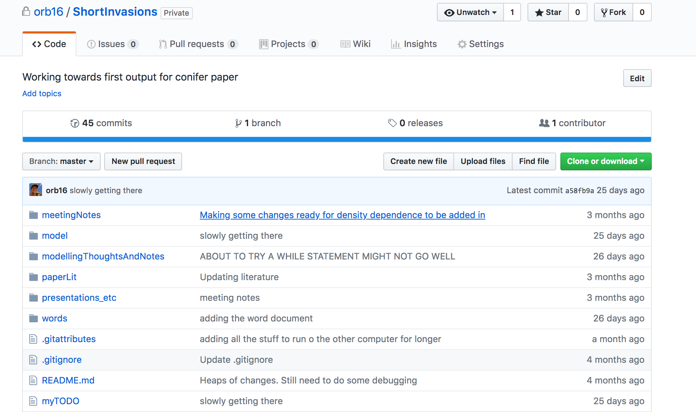
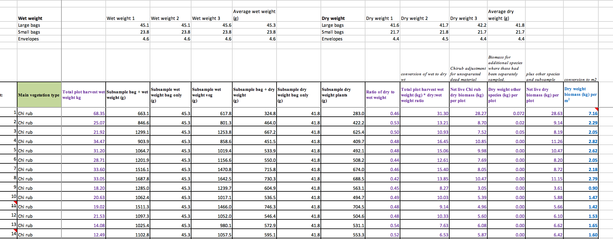
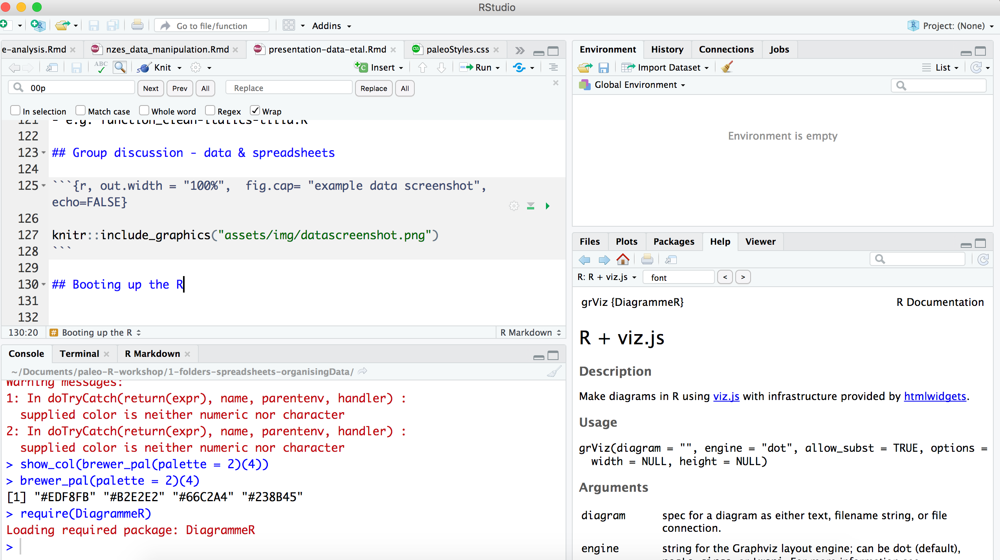
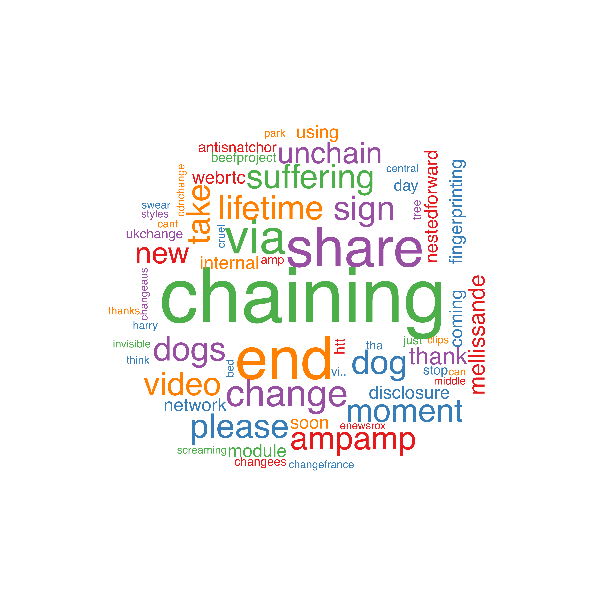

```{r setup, include=FALSE}
knitr::opts_chunk$set(echo = FALSE)
require(DiagrammeR, quietly = TRUE)
```

## Welcome, and overview

### First session:

- Not heaps of paleo-specific R
- But building blocks to make you an expeRt
- Things that go into R (data inputs)
- How to structure your data inputs and outputs
- Getting started in R

## Welcome, and overview

### Second session:

- Data validation
- Data visualisation
- NMDS
- RDA 
- Plotting NMDS etc for publications
- Saving and export

## BD (before data): project structures

  (1) Raw data (as entered)
  (2) Corrected and modified data
  
  
## BD (before data): project structures
  
### Keep a record of how you went from (1) to (2) - even if you don't do it in R 

  (1) Correct/modify data in R (with reminders)
  (2) Create a new spreadsheet and keep a .txt records
  
## Project structures

```{r}

DiagrammeR::grViz("
digraph rmarkdown{

node[fillcolor = orange,fontname = Helvetica,color=white,style=filled]
project->data
data->rawData
data->cleanData
project->R
R -> dataCleaning
R-> analysis
project->output
output->figs
output->tables
}

           ")
```

## Where should a project live?

Pros and cons of the following: 

- MW-LCR shared drives
- Dropbox (C:/)
- Github (C:/)
- MW-LCR personal drive

## Where should a project live

```{r, out.height = "400px", out.width = "700px", fig.cap= "githubScreenshot", echo=FALSE}


```


## Within the project: naming files
http://www2.stat.duke.edu/~rcs46/lectures_2015/01-markdown-git/slides/naming-slides/naming-slides.pdf

Three principals:

(1) Machine readable 
(2) Human readable
(3) Works with default ordering

## Machine readable

- no punctuation symbols 
- no spaces
- be careful with capitals
- for data, easy to parse 

## Machine readable

- e.g. year_site_coreNUM_type
- e.g. 2018-06-31_eweburn_X18-062_concentrations.csv 
- e.g. 2018-06-31_eweburn_X18-062_age-depth.csv
- e.g. 2018-06-31_eweburn_X18-062_species-dictionary.csv

note that we separate units of metadata with a "_" and within units, with a "-".

## Human readable

- This applies to scripts and data 

- e.g. 1_data-cleaning-vegetation.R
- e.g. 2_data-cleaning-species-dictionary.R
- e.g. function_plot-all-species.R
- e.g. function_clean-italics-tilia.R

## Group discussion - data & spreadsheets

```{r, out.width = "100%",  fig.cap= "example data screenshot", echo=FALSE}


```

## Booting up the R

```{r, out.width = "100%",  fig.cap= "rstudio", echo=FALSE}


```


## The basics (1)

```{r, echo = TRUE, eval = TRUE}
getwd()

```


## The basics (2)

```{r, echo = TRUE, eval = FALSE}
setwd()

```


## The basics (3)

```{r, echo = TRUE, eval = TRUE}
sessionInfo()

```


## The basics (4)

```{r, echo = TRUE, eval = TRUE}
require(tidyverse)

```


## Example data

```{r, echo = TRUE, message = FALSE, warning=FALSE}

# install.packages("vegan")
# install.packages("skimr")
require(vegan)
require(skimr)
data("mite")             # the data command only works for in-built data
data("mite.env")         # we'll cover reading in your own data later on


```

## Viewing data

```{r, echo = TRUE, eval = FALSE}
head(mite, n = 6)
```

```{r, echo  = FALSE, results = "asis"}

head(mite) %>%
  kable()

```

## The basics (5)

- When you just want one column, you can use the following format `dataframeNAME$columnNAME`

```{r, echo = T}

mite$Brachy

```

## Viewing data

```{r, echo = TRUE}
skim(mite)
```

## Live coding demo 

- Select some columns 
- Filter just some observations
- Histogram of one column


## Select - concept 

Select chooses certain columns - to keep, or to get rid of.
The format is 

`DATANAME %>% select(col1, col2, col3)` 


## Select - examples

```{r echo = TRUE}
mite %>% 
  select(Brachy, PHTH, HPAV)
```

## Select - examples

```{r echo = TRUE}
names(mite)
mite %>% 
  select(-c(PHTH:Oppiminu))
```


## Select - discussion

- What is the difference between `$` and `select`?
```{r, echo = TRUE, eval = FALSE}
mite$Brachy               # 'base' R
mite["Brachy"]            # 'base R
mite %>% select(Brachy)   # tidyverse
mite %>% pull(Brachy)     # tidyverse but we haven't discussed this one yet
```


## What is this?  %>%  %>%  %>% 

<p style="text-align:center"></p>

## What is this?  %>%  %>%  %>% 

Chaining allows us to write code in the order we want it done. Otherwise, it must be wrapped in brackets with the first thing to be done right in the middle. 

`mite.env %>% select(Shrub, Topo)`

means, take the mite.env dataframe, and then select the columns Shrub and Topo. 

## Filter - concept

Filter selects rows in your dataframe, based on the conditions you specify.  Same format as for `select()`:

`filter(DATA, CONDITION1)` 

 - row only selected if condition satisfied 

## Filter - concept

`filter(DATA, CONDITION1 & CONDITION2)` 

- both conditions must be satisfied 

`filter(DATA, CONDITION1 | CONDITION2)` 

- one or both conditions must be satisfied 

## Filter - example

```{r, echo = TRUE}
mite.env %>% filter(WatrCont > 650)
```

## Filter - example with two conditions

Here, `Shrub` has to equal "Few". If you want to select two values (such as two sites) see the next slide. 

```{r, echo = TRUE}
mite.env %>% filter(WatrCont > 650 & Shrub == "Few")
```

## Filter - example selecting > 1 element

```{r, echo = TRUE}
unique(mite.env$Substrate)

mite.env %>% filter(Substrate %in% c("Litter", "Barepeat", "Interface"))

```

## Histogram: concept

- We use the command `ggplot` which comes from the ggplot2 package. 
- `ggplot()` just initiates the plot
- then we tell it to draw a histogram with the `geom_histogram()` part.

`ggplot(data = DATAFRAME, aes(x = COLUMN_FOR_HISTOGRAM)) + geom_histogram()`


## First example plot: histogram

```{r, echo = TRUE}

ggplot(data = mite.env, aes(x = SubsDens)) +
  geom_histogram() 

```

## First example plot: histogram

```{r, echo = TRUE}

ggplot(data = mite.env, aes(x = SubsDens)) +
  geom_histogram(binwidth = 10) 

```

## Reading in **real** data!

Actually, it should be real, but it should also be *tidy*

## Reading in **real** data!

- Where is the file
- How do we tell R to get there
    - This also depends where R has the working directory
- We need to tell R how to get from the working directory, to the file that we want to read in!

`getwd()` 

`setwd()`

## What happens with untidy data?

```{r, echo = TRUE}

aMess <- read.csv("data/messyDataExample.csv")

head(aMess)

```

## What happens with untidy data?

- To see the whole thing: `View(aMess)`

- Compare the output of `names(aMess)` and `names(mite.env)`


## Let's fix it, and read it back in

[group task]


## Read in tidied data

- Where is it
- Where is the working directory?
- Where is the file in relation to our working directory?
- What did we call it (ie the filename)?!

- **Then we can read it back in**

## Read in Awarua data

- Where is it?
- Where is the working directory?
- Where is the file in relation to our working directory?
- What is the filename? 

## Awarua data

```{r, echo = TRUE}
awarua <- read.csv("data/awaruaForestExample.csv")
head(awarua)

```

## Awarua - exercise

- create a subset of the data.frame called "awaruaCharcoal"
- we only want up to and including 20 cm
- we only want the Depth column, and the two charcoal columns
- *bonus* rename the depth column `Depth..cm.` to depth_CM

```{r, echo = TRUE, eval = FALSE}
awaruaCharcoal <- awarua %>%
  [...]
```

## Awarua - exercise answer

```{r, echo = TRUE}

awaruaCharcoal <- awarua %>%
  filter(Depth..cm. <= 20) %>%
  select(depth_CM = Depth..cm., PCHARS, PCHARL)

head(awaruaCharcoal, 2)

```

## Awarua - plot example

```{r, echo = TRUE}

charcoalPlot <- ggplot(data = awaruaCharcoal, aes(x = depth_CM, y = PCHARS)) +
  geom_line() +    
  theme_classic() +
  labs(x = "Depth (cm)", y = "Charcoal", title = "Charcoal within Awarua wetland",
       subtitle = "Forest site")
charcoalPlot

```

## Awarua - plot exercise - modifying plots

- Can you change the title of the y-axis to something else?
- Can you change the colour of the line? 
- [extension] try googling to see if you can find out how to reverse the direction of the x-axis

## Awarua - plot exercise - creating a plot

- Take the original awarua data (`awarua`), make a plot of depth vs DACCUP
- Style it as you want
- How would we add extra lines for DACDAC & MYRSIN? 

## Awarua - plot creation answer {.smaller}

- NB there are easier ways of doing this - but we have to reshape the data first

```{r, echo = TRUE, fig.width = 3}

awaruaPlot <- ggplot(awarua, aes(x = Depth..cm., y = DACCUP)) +
  geom_line() + 
  geom_line(aes(y = DACDAC), linetype = "dashed") + 
  geom_line(aes(y = MYRSIN), linetype = "dotted") +
  theme_classic() +
  scale_x_reverse() +
  coord_flip() +  # switches the x and y axes
  labs(y = "Count", x = "Depth (cm)")
awaruaPlot

```

## Mutate - concept

- Sometimes we want to change values in a column. For example, take the log or square-root. 
- Or we may want to calculate the percentage instead of counts
- When we change values, we use the function `mutate`.
- We give the name of the new column we want, and what we want to do to the old column

`dataFRAME %>% mutate(logDACDAC = log(DACDAC))` 
<br>
`dataFRAME %>% mutate(sqrtCHARCOAL_SML = sqrt(PCHARS))`

## Mutate - example

```{r echo = TRUE}
awaruaCharcoal %>%
  mutate(totalCharcoal = PCHARS + PCHARL) 
```

## Mutate - example

```{r, echo = TRUE, results = "hide"}
# just calculate rowSums
rowSums(awarua)

# but we don't want to sum the charcoal and depth columns!
rowSums(awarua %>% select(-c(Depth..cm., PCHARL, PCHARS)))

# also we'd like it actually as a new column in the dataframe...
# so we take the code above, give the new col a name ("allRows")
awaruaWithTotals <- awarua %>%
 mutate(allRows = rowSums(awarua %>% select(-c(Depth..cm., PCHARL, PCHARS))))

```

## Mutate - example

- to transform everything to percents, 
- we use a special form of mutate
- and we choose which columns to 

```{r, echo = TRUE}
awaruaVeg <- awaruaWithTotals %>%
  select(-c(PCHARL, PCHARS, allRows, Depth..cm.)) %>% 
  mutate_all(.funs = function(eachColumn) {100 * eachColumn / awaruaWithTotals$allRows})

head(awaruaVeg)
```

## Mutate example - cont

- Now we put the Depths column back with the vegetation

```{r, echo = TRUE}
awaruaVegDepths <- data.frame(Depths = awaruaWithTotals$Depth..cm.,
                              awaruaVeg)

head(awaruaVegDepths)

```
