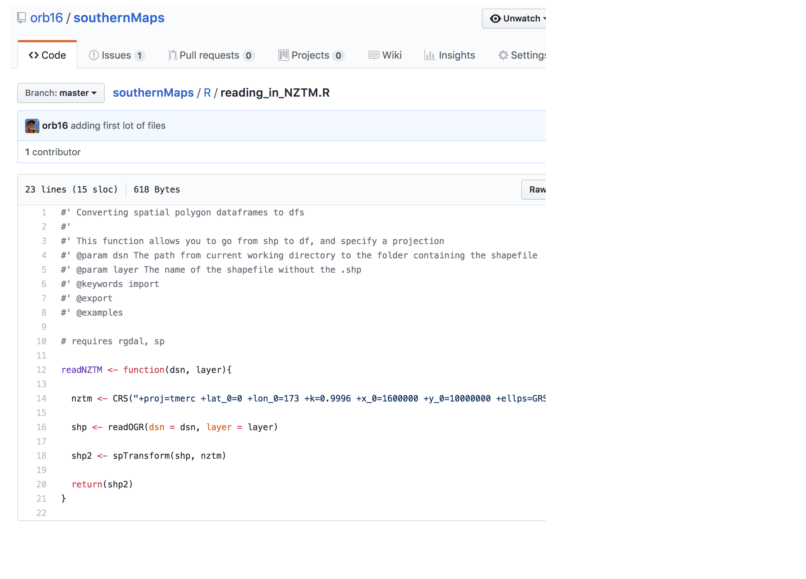

```{r setup, include=FALSE}
knitr::opts_chunk$set(echo = FALSE)
require(rioja)
require(analogue)
require(vegan)
require(tidyverse)

```

## Overview

### This session will try to mimic workflows e.g.

- Getting data in (again `r emo::ji("smile")`) 
- Doing an analysis (e.g. ordination)
- Plotting the analysis
- Saving the plot and the analysis output 

## Overview cont

- If anyone has any specific requests
- we can try some live coding `r emo::ji("grimacing face")``r emo::ji("grimacing face")`
- otherwise we will work through some examples
- NB re plotting stratigraphic diagrams - nothing as specialised and all-encompassing as non-R options. 

## Overview of *packages* available in R

<div class="columns-2">
- Packages are just collections of *functions*
- Functions are just bits of code where you can swap the inputs around
- e.g. read.csv is a function, and the input you change is the filename. 

<div></div>

## Overview of *packages* available in R

- **neotoma** - an interface to the neotoma paleo database. You can download data from within R. By ROpenSci (consortium) & Simon Goring
- **rioja** - most useful as it has a `read.Tilia` function allowing old Tilia datasets to be read in. By Steve Juggins. Also some functions for transfer functions, plotting, constrained heirarchical clustering (zonation)
- **analogue** - More transfer functions and analogue techniques
- **vegan** - multivariate data analysis used a lot by neoecologists too. We will use this today for the ordinations. 
- **paleofire** - get data out of the Global Charcoal Database and analyse it


## New packages required [group install]

```{r, eval=FALSE, echo = TRUE}

# if you don't have any of the packages below
# use the following examples to install them
install.packages(analogue)
install.packages(rioja)

# now load the packages: 

# for multivariate analyses
require(vegan)

# for data manipulation
require(tidyverse)

# for examples of stratigraphic plot functionality
require(analogue)
require(rioja)


```


## Read in data

- Where is the file? 
- Where is our working directory? 
- What is the path from the working directory to the file?

```{r, echo = TRUE}
getwd()
eweburnCounts <- read.csv(
  file = "../1-folders-spreadsheets-organisingData/data/EWEBURN-9711PWKA.csv"
  )

head(eweburnCounts)
```


## Read in data cont

- the ".." in the previous slide `../1-folders` means go up out of the current working directory one level
- we need to go up a level 

## It looks different to Tilia :-/

Data comes in "long" and "wide" forms. **And** you need to know how to convert between both! 

### Why? 
<br>
Because some packages require the long format and some require the wide. No escape! Luckily the code is relatively easy. 

## Wide and long

- Conceptually, "long" data has a column for a category (e.g. *species*) and a column for the value for that species (e.g. *counts*)

- Whereas "wide" data has the values for each category under the category name

- NB I use "*category*" here as it seems more intuitive but the help page uses the term "*key*"

## Convert wide to long - concept

We use the `gather()` function as so:

`DATASET %>% gather(key = "species", value = "counts", colNameA:colNameZ)`

You can change the "species" and "counts" to whatever names you want for the columns. Just note that whatever you choose to use needs to be surrounded by quotes (as above). [help page discussion `?gather`]

## Wide to long - example

(1) Please read in the mites dataset (from package vegan, with one amendment) 

```{r, echo = TRUE}
mites <- read.csv("data/vegan_mites.csv")
head(mites, 1)
```

We need to decide which columns are to be included in the species column

## Wide and long - example

```{r echo = TRUE}

longMites <- mites %>% 
  gather(key = "species", value = "counts", 
         Brachy:Trimalc2)

```

## Long data histogram

```{r echo = TRUE, message = FALSE, warning=FALSE}
shortishMites <- mites %>% 
  gather(key = "species", value = "countPerPlot", 
         Brachy:Trimalc2) %>%
  filter(species %in% c("Brachy", "HPAV", "PWIL")) 

ggplot(data = shortishMites, aes(x = countPerPlot)) +
  geom_histogram() +
  facet_wrap(~ species)

```

## Long data histogram

- What would have happened if we didn't use `filter` first? 
- Have a go. 

## One more diversion: summaries 

- Summarising things - by species, for example - is often done best in long format. 
<br>
- Sometimes we want a summary for the whole dataset, and sometimes we want it _**by a group**_

## Summarising concept

### Lots of summary functions in R
- `mean()` (we use this below)
- `sd()`
- `min()`
- `max()`

```{r eval = FALSE, echo = TRUE}

DATASET %>% summarise(NEW_COL_NAME = mean(EXISTING_COLUMN_NAME))

DATASET %>% group_by(GROUP_COLUMN_NAME) %>%
  summarise(NEW_COL_NAME = mean(EXISTING_COLUMN_NAME)
```

## Summarising example (1)

```{r echo = TRUE}

longMites %>% # this is the object we made a bit earlier
  summarise(meanCount = mean(counts)) # mean count across all plots and all species

```


## Summarising example (2)

```{r echo = TRUE}

longMites %>% # this is the object we made a bit earlier
  group_by(species) %>% # adding this line means we'll get a summary by each species
  summarise(meanCount = mean(counts)) # mean count for each species

```

## Summarising example (3)


```{r echo = TRUE}

longMites %>% # this is the object we made a bit earlier
  filter(plot < 6) %>% # take only plots 1 through 5
  group_by(species) %>% # adding this line means we'll get a summary by each species
  summarise(meanCount = mean(counts)) # mean count for each species

```

## Back to business: long to wide concept

- We use the `spread()` function to go from long to wide. 
- Here we only have to say the 'key' and 'value' columns

```{r, echo = TRUE, eval = FALSE}
DATASET %>%
  spread(key = SPECIES, value = N_COUNTED_PER_PLOT)
```

## Long to wide example

```{r echo = TRUE}
head(longMites, 2)
longMites %>%
  spread(key = species, value = counts)
```

## Long to wide example (2)

```{r echo = TRUE}

longMites %>%
  spread(key = species, value = counts, 
         sep = "_")
```

## Back to Eweburn and ordinating

- You can only have one "key" column (ie species). 
- But in this dataset we have more than one key column
- In this case I've chosen to keep the "FullNames"

```{r, echo = TRUE}
eweburnWide <- eweburnCounts %>% 
  filter(!Sums %in% c("W", "F")) %>%
  select(FullNames, counts, Depths) %>% 
  spread(FullNames, counts) %>%
  data.frame()
eweburnWide
```

## Which species to go in the ordination? {.smaller}

- Best to look at this on your own screen - there's a lot!

```{r, echo = TRUE, eval = FALSE}

names(eweburnWide)

```

## Select the right columns before ordination

- Need to drop the depth column, summary columns, charcoal counts


```{r, echo = TRUE}
eweVeg <- eweburnWide %>% 
  select(X.iAlnus : X.Poa..40um.not..iChionochloa)
names(eweVeg)
```

## After all the tidying: *ordination* {.smaller}

- we give the function the name of the data object (`comm`)
- the distance we want to use (`distance`)
- the number of dimensions to use (`k`)

```{r, echo = TRUE}
ord <- metaMDS(comm = eweVeg, distance = "jaccard",
               k = 2)
```

## Ordination basic results (1)

```{r echo = TRUE}
ord
```

## Ordination basic results (2)

```{r echo = TRUE, fig.height = 5}
stressplot(ord)
```

## Ordination plotting

- there is the *easy* way to do this. And the *hard* way

```{r echo = TRUE, fig.height=4}
# the easy way
plot(ord, "species")
text(ord, "sites")

```

## Ordination plotting

```{r, echo=TRUE, fig.height = 5}
# just the sites (ie depths which were sampled)
plot(ord, "sites")
```

## The difficult way

```{r, echo = TRUE}

plottingDat <- data.frame(
  eweburnWide %>% select(Depths), 
  scores(ord, "sites"))

head(plottingDat)

```

## The difficult way 

```{r, echo = TRUE}
plottingDat <- plottingDat %>%
  mutate(DepthCategorical = ifelse(Depths < 70, "Shallow", "Deep"))

ordPlot <- ggplot(plottingDat, aes(x = NMDS1, y = NMDS2)) +
  geom_point(aes(colour = DepthCategorical), size = 2)  +
  coord_equal() # necessary for ordination plots
ordPlot

```

## Customising 

```{r, echo = TRUE, fig.height = 4}

ordPlot2 <- ordPlot + theme_minimal() +
  theme(legend.position = "bottom")
ordPlot2

```

## Customising

```{r, echo = TRUE, fig.height = 4}
ordPlot2 + 
  scale_colour_manual(values = c(
    "darkblue", "orange"
  ))
```

## Clustering - hierarchical

- for this you need a distance matrix from `eweVeg`
- same distance method as you did for the ordination (assuming you want them to be consistent)
- also need to think about which method you want to use

```{r, echo = TRUE}
# create a distance matrix from vegetation
vdist <- vegdist(eweVeg, 
                 # binary = TRUE, # if you want to do it based on pres/abs
                 method = "jaccard")
```

## Clustering - hierarchical

```{r echo = TRUE, fig.height = 4.5}
ourClustering <- hclust(vdist, method = "complete")
plot(ourClustering)
```


## Stratigraphic plots

```{r, include = FALSE, eval = FALSE}

require(readxl)
tmp <- read_excel(path = "../1-folders-spreadsheets-organisingData/data/eweburn2.xlsx") %>%
  filter(FullNames2 != "Asteraceae total")
  
tmp2 <- tmp %>% 
  select(FullNames2, Depths, counts) %>%
  spread(FullNames2, counts) %>%
  select(Depths, everything())

tmp3 <- tmp %>%
  group_by(FullNames2, category) %>%
  slice(1) %>%
  select(FullNames2, category) %>%
  data.frame()

write.csv(tmp2, file = "data/eweburnFull.csv", row.names = FALSE)
write.csv(tmp3, file = "data/eweburnFullDictionary.csv", row.names = FALSE)


```

- For this we'll load some new data
- This plot uses the package `analogue`

```{r echo = TRUE, fig}
newEweburn <- read.csv("data/eweburnFull.csv")
eweburnDictionary <- read.csv("data/eweburnFullDictionary.csv")
eweburnSpecies <- newEweburn%>% select(-Depths)
```

## Stratigraphic plot {.smaller}

```{r, echo = TRUE}
averageAbundance <- mean(colSums(eweburnSpecies))
myThreshold <- quantile(colSums(eweburnSpecies), probs = .7)

Stratiplot(x = eweburnSpecies[colSums(eweburnSpecies) > myThreshold], 
           y = newEweburn$Depths,
           type = "poly", 
           col.poly = "royalblue",
           rev = TRUE,
           # strip = TRUE,
           sort = "wa", 
           ylab = "Depth")
```

## Stratigraphic plot

- Note that in the previous plot it was sorted by weighted averaging 
- Try commenting out the `"sort = 'wa'"` argument and see what happens

## Stratigraphic plot v 2

```{r, echo = TRUE}
tp <- strat.plot(d = eweburnSpecies[colSums(eweburnSpecies) > myThreshold], 
           yvar = newEweburn$Depths,
          plot.poly = TRUE, col.poly = "darkblue",
          col.poly.line = NA, 
          exag = TRUE, 
          y.rev=TRUE,
           wa.order = "topleft")

```

## Stratigraphic with constrained cluster analysis {.smaller}

```{r, echo = TRUE}

VD <- vegdist(eweburnSpecies, "jaccard")
clust <- chclust(VD, method = "coniss")
bstick(clust) # hmm perhaps 3 or 5

```


## Stratigraphic with constrained cluster analysis & colours {.smaller}

```{r, include = FALSE}
# eweburnDictionary[match(names(eweburnSpecies[colSums(eweburnSpecies) > myThreshold]),make.names(eweburnDictionary$FullNames2)),]
# names(eweburnSpecies[colSums(eweburnSpecies) > myThreshold])
```

```{r, echo = TRUE}
# set the colours
herb <- "white"
beech <- "#d95f02"
shrub <- "#66a61e"
conifer <- "#7570b3"
otherTree <- "#e7298a"

ourCols <- c(
            shrub, conifer, conifer, shrub, herb, beech, conifer,
            otherTree, shrub, beech, conifer,
            herb, conifer, conifer, conifer, herb, herb
          )

data.frame(species =  names(eweburnSpecies[colSums(eweburnSpecies) > myThreshold]),
           ourCols) %>%
  head()


```


## Complicated stratigraphic cont {.smaller}

```{r echo = TRUE, fig.height =4}
tp2 <- strat.plot(d = eweburnSpecies %>% select_if(colSums(.) > myThreshold), 
           yvar = newEweburn$Depths, plot.poly = TRUE, col.poly = ourCols,
          col.poly.line = "black", exag = TRUE, srt.xlabel = 45,
          y.rev=TRUE,clust = clust, wa.order = "topleft", cex.ylabel = 0.8, cex.xlabel = 0.8)
addClustZone(tp, clust, 3, "black", lwd = 3, lty = "dashed")
```

## Outputting things

- There are easy to commands to save things
- But an important point is to remember that if you give something a file name, by default it will save in the working directory
- As with reading things in, you can specify where (in relation to the working directory) you want something saved

## Outputting things - key functions

- For tables: `write.csv()`
- For plots made with `ggplot`: `ggsave`
- For other plots: `png() or tiff()`

## Outputting tables: concept

- where do we want to write out the file to?
- where is that in relation to the working directory?
- do we need to create a new folder? 

`write.csv(x = objectName, y = "folderName/FILENAME.csv", row.names = FALSE`

## Outputting tables: example

```{r, echo = TRUE}
write.csv(x = plottingDat,
          file = "out/tables/NMDS-scores.csv",
          row.names = FALSE)
```

## Outputting ggplots: concept

- give the plot a name when you make it
- as above - think about where to save it

`ggsave(filename = "pathToFile/FILENAME.png", plot = plotName, width, height, units, dpi)`

## Outputting ggplots: example

- if you want a tiff, just change the end of the filename to .tiff

```{r echo = TRUE}
ggsave(filename = "out/figs/ordinationPlot.png",
       plot = ordPlot2,
       width = 200, height = 210, units ="mm",
       dpi = 500)
```

## Outputting all other plots: concept

(1) here you use a `png()` command
(2) then use the same code you would to print the plot to screen
(3) then use `dev.off()` to tell R to stop printing to the file and to resume the interactive session
(4) note that you use `res` instead of `dpi` to specify image quality

```{r eval = FALSE, echo = TRUE, message=FALSE}
png(filename = "pathToFile/FILENAME.png", width, height, units, res)
# just example plot code
tp2 <- strat.plot(d = eweburnSpecies %>% select_if(colSums(.) > myThreshold), 
           yvar = newEweburn$Depths, plot.poly = TRUE, col.poly = ourCols,
          col.poly.line = "black", exag = TRUE, srt.xlabel = 45,
          y.rev=TRUE,clust = clust, wa.order = "topleft", cex.ylabel = 0.8, cex.xlabel = 0.8)
addClustZone(tp, clust, 3, "black", lwd = 3, lty = "dashed")

dev.off()
```

## Outputting all other plots: example (1)

```{r, echo = TRUE, message=FALSE, results = "hide"}
png(filename = "out/figs/stratigraphicPlot.png", 
    width = 300, height = 200, units = "mm", res = 500)

tp2 <- strat.plot(d = eweburnSpecies %>% select_if(colSums(.) > myThreshold), 
           yvar = newEweburn$Depths, plot.poly = TRUE, col.poly = ourCols,
          col.poly.line = "black", exag = TRUE, srt.xlabel = 45,
          y.rev=TRUE,clust = clust, wa.order = "topleft", cex.ylabel = 0.8, cex.xlabel = 0.8)
addClustZone(tp, clust, 3, "black", lwd = 3, lty = "dashed")

dev.off()
```

## Outputting all other plots: example (2)

- try this code and then check out how large the file is! 
- tiff is a 'loss-less' format

```{r, echo = TRUE, eval = FALSE}
tiff(filename = "out/figs/stratigraphicPlot.tiff", 
     width = 300, height = 200, units = "mm", res = 500)

tp2 <- strat.plot(d = eweburnSpecies %>% select_if(colSums(.) > myThreshold), 
           yvar = newEweburn$Depths, plot.poly = TRUE, col.poly = ourCols,
          col.poly.line = "black", exag = TRUE, srt.xlabel = 45,
          y.rev=TRUE,clust = clust, wa.order = "topleft", cex.ylabel = 0.8, cex.xlabel = 0.8)
addClustZone(tp, clust, 3, "black", lwd = 3, lty = "dashed")

dev.off()
```
